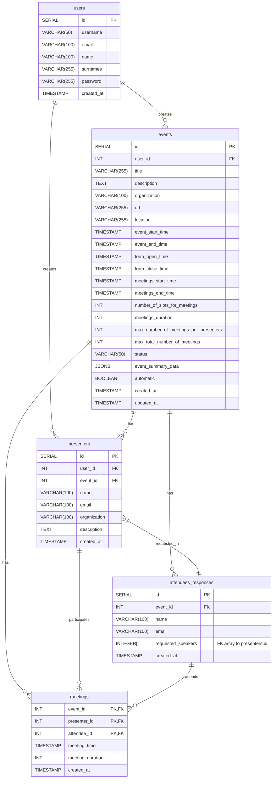

# Tech2Net Database Schema

This directory contains the PostgreSQL schema for the **Tech2Net** platform, which enables optimized scheduling of one-on-one meetings between event attendees and presenters.

## Files

- `schema.sql`: Main schema definition
- *(optional)* `seeds.sql`: Seed data for initial testing (not included yet)

## Overview

The schema supports multiple events, each managed by a user (organizer), with their own list of presenters and attendees. Attendees submit preferences via forms, and the backend performs a linear optimization to assign meetings. The scheduled meetings are stored and later used for communication, reporting, or feedback.

## Tables and Structure

### users

Stores platform users (primarily organizers). Users can create and manage events.

- `id`: Primary key
- `username`, `email`: Unique identifiers
- `name`, `surnames`, `password`: Personal information
- `created_at`: Timestamp of account creation

### events

Represents an event created by a user. It contains scheduling constraints, meeting configuration, and lifecycle metadata.

- `id`: Primary key
- `user_id`: Foreign key to `users`
- `title`, `description`, `organization`, `location`, `url`: Event information
- `event_start_time`, `event_end_time`: When the event takes place
- `form_open_time`, `form_close_time`: When attendees can submit preferences
- `meetings_start_time`, `meetings_end_time`: Valid timespan for scheduling meetings
- `number_of_slots_for_meetings`, `meetings_duration`: Time constraints
- `max_number_of_meetings_per_presenters`, `max_total_number_of_meetings`: Allocation limits
- `status`: Lifecycle status ('published','open', 'matching', 'scheduled', 'cancelled', 'closed')
- `event_summary_data`: JSONB with computed stats (optional)
- `automatic`: Whether the system assigns meetings automatically
- `created_at`, `updated_at`: Metadata

### presenters

Contains information about presenters (speakers) associated with a specific event. Presenters are not required to be users of the platform.

- `id`: Primary key
- `user_id`: Foreign key to `users` (event creator)
- `event_id`: Foreign key to `events`
- `name`, `email`, `organization`, `description`: Presenter details
- `created_at`: Timestamp

### attendees_responses

Captures one-time responses from attendees expressing which presenters they wish to meet. Each attendee provides an array of preferred presenter IDs.

- `id`: Primary key
- `event_id`: Foreign key to `events`
- `name`, `email`: Attendee identity
- `requested_speakers`: Array of presenter IDs (INTEGER[]) (Array of Foreign keys)
- `created_at`: Timestamp

### meetings

Final scheduled one-on-one meetings between presenters and attendees. Meetings are created after processing the attendees' preferences.

- `event_id`: Foreign key to `events`
- `presenter_id`: Foreign key to `presenters`
- `attendee_id`: Foreign key to `attendees_responses`
- `meeting_time`: Timestamp when the meeting occurs
- `meeting_duration`: Duration in minutes
- `created_at`: Timestamp
- `PRIMARY KEY (event_id, presenter_id, attendee_id)`: Uniqueness constraint per event

## Entity Relationship Diagram


## How to Use

1. Create the PostgreSQL database:

   ```bash
   createdb tech2net_db
   ```

2. Run the schema definition:

   ```bash
   psql -U your_user -d tech2net_db -f schema.sql
   ```

3. Confirm creation:

   ```bash
   \dt  -- list tables
   \di  -- list indexes
   ```

## Notes

* This schema assumes that attendees do not require full accounts.
* Matching and scheduling logic is implemented outside the database in the backend (Node.js).
* Additional features like PDF generation, emails, or feedback tracking are planned but not included here.

